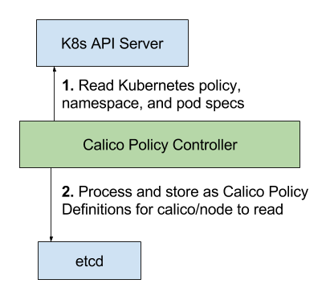

## Calico Network Policy for Kubernetes 

<blockquote>
Note that the documentation in this repo is targeted at Calico contributors.
<h1>Documentation for Calico users is here: <a href="http://docs.projectcalico.org">http://docs.projectcalico.org</a></h1>
</blockquote>

This repository contains the Calico Kubernetes policy controller, which implements the Kubernetes network policy API.  

The controller uses the Kubernetes v1beta1 network policy API to configure Calico network policy.  The policy controller addon is deployed on top of Kubernetes as a pod. 

Calico can enforce NetworkPolicy on top of:
- [Calico BGP networking](https://github.com/projectcalico/calico-containers/blob/master/docs/cni/kubernetes/KubernetesIntegration.md)
- [Flannel networking](https://github.com/tigera/canal)
- [GCE native cloud-provider networking](http://kubernetes.io/docs/getting-started-guides/gce/)

See the documentation on [network policy in Kubernetes](http://kubernetes.io/docs/user-guide/networkpolicies/) for more information on how to use NetworkPolicy. 

Calico also supports a [mode](http://docs.projectcalico.org/v2.4/getting-started/kubernetes/installation/hosted/kubernetes-datastore/) which 
uses the Kubernetes API directly without the need for its own
etcd cluster. When running in this mode, the policy controller is not required.

### Resources

* [Configuration guide](configuration.md)
