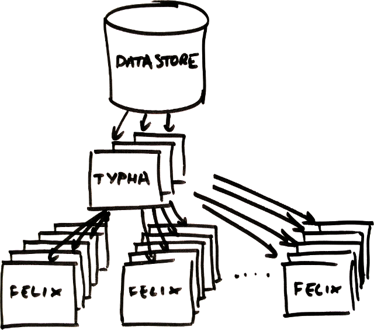

[](https://semaphoreci.com/calico/typha)
[](https://coveralls.io/github/projectcalico/typha?branch=master)
[](https://slack.projectcalico.org)
[](https://kiwiirc.com/client/irc.freenode.net/#calico)
# Project Calico

<!--
<blockquote>
Note that the documentation in this repo is targeted at Calico contributors.
<h1>Documentation for Calico users is here:<br><a href="http://docs.projectcalico.org">http://docs.projectcalico.org</a></h1>
</blockquote>
-->

This repository contains the source code for Project Calico's optional Typha daemon, which is
currently in beta.  An instance of Typha sits between the datastore (such as the
Kubernetes API server) and many instances of Felix.



This has many advantages:

- Since one Typha instance can support hundreds of Felix instances, it reduces the load on the datastore
  by a large factor.

- Since Typha can filter out updates that are not relevant to Felix, it also reduces Felix's
  CPU usage.  In a high-scale (100+ node) Kubernetes cluster, this is essential because the
  number of updates generated by the API server scales with the number of nodes.

## How can I try Typha?

We're still in the process of adding Typha to our documentation.  In the meantime, if you're

- using the Kubernetes Datastore Driver (KDD)
- with Kubernetes 1.6+
- with RBAC disabled (or you're comfortable adding a service account for Typha!)

and you'd like to try it out, follow the instructions below...

Since Typha has the most impact when using the KDD, we're focusing on that to begin with.  Install the Kubernetes
specs below to create a 3-node deployment of Typha and expose them as a service called `calico-typha`.  A three-node
deployment is enough for ~600 Felix instances.  Typha scales horizontally so feel free to reduce/increase
the number of replicas.  If you're running a small cluster, you may wish to reduce the CPU reservation
proportionately.


    apiVersion: v1
    kind: Service
    metadata:
      name: calico-typha
      namespace: kube-system
      labels:
        k8s-app: calico-typha
    spec:
      ports:
        - port: 5473
          protocol: TCP
          targetPort: calico-typha
          name: calico-typha
      selector:
        k8s-app: calico-typha
    ---
    apiVersion: extensions/v1beta1
    kind: Deployment
    metadata:
      name: calico-typha
      namespace: kube-system
      labels:
        k8s-app: calico-typha
    spec:
      replicas: 3
      revisionHistoryLimit: 2
      template:
        metadata:
          labels:
            k8s-app: calico-typha
          annotations:
            scheduler.alpha.kubernetes.io/critical-pod: ''
        spec:
          tolerations:
          - key: CriticalAddonsOnly
            operator: Exists
          hostNetwork: true
          containers:
          - image: calico/typha:v0.2.2
            name: calico-typha
            ports:
            - containerPort: 5473
              name: calico-typha
              protocol: TCP
            env:
              - name: TYPHA_LOGFILEPATH
                value: "none"
              - name: TYPHA_LOGSEVERITYSYS
                value: "none"
              - name: TYPHA_LOGSEVERITYSCREEN
                value: "info"
              - name: TYPHA_PROMETHEUSMETRICSENABLED
                value: "true"
              - name: TYPHA_PROMETHEUSMETRICSPORT
                value: "9093"
              - name: TYPHA_DATASTORETYPE
                value: "kubernetes"
              - name: TYPHA_CONNECTIONREBALANCINGMODE
                value: "kubernetes"
            volumeMounts:
            - mountPath: /etc/calico
              name: etc-calico
              readOnly: true
            resources:
              requests:
                cpu: 1000m
          volumes:
          # Mount in the Calico config directory from the host.
          - name: etc-calico
            hostPath:
              path: /etc/calico


Once you have a Typha service running, you can tell Felix `v2.3.0+` (`calico/node:v1.3.0+`) to connect
to it by setting the following environment variable in your calico/node pod spec, which tells
Felix to discover Typha using the Kubernetes service API:


    - name: FELIX_TYPHAK8SSERVICENAME
      value: "calico-typha"


**Note**:

- You must also configure Felix with direct datastore access (using the same datastore as Typha!),
  since Felix needs to connect to the datastore itself to load its configuration before it connects
  to Typha.  If Felix was working before adding the above environment variable, you should be good to go.


## How can I get support for contributing to Project Calico?

The best place to ask a question or get help from the community is the
[calico-users #slack](https://slack.projectcalico.org).  We also have
[an IRC channel](https://kiwiirc.com/client/irc.freenode.net/#calico).

## Who is behind Project Calico?

[Tigera, Inc.](https://www.tigera.io/) is the company behind Project Calico
and is responsible for the ongoing management of the project. However, it
is open to any members of the community – individuals or organizations –
to get involved and contribute code.

## Contributing

Thanks for thinking about contributing to Project Calico! The success of an
open source project is entirely down to the efforts of its contributors, so we
do genuinely want to thank you for even thinking of contributing.

Before you do so, you should check out our contributing guidelines in the
`CONTRIBUTING.md` file, to make sure it's as easy as possible for us to accept
your contribution.

## How do I build Typha?

Typha mostly uses Docker for builds.  We develop on Ubuntu 16.04 but other
Linux distributions should work (there are known Makefile that prevent building on OS X).  
To build Typha, you will need:

- A suitable linux box.
- To check out the code into your GOPATH.
- Docker >=1.12
- GNU make.

Then, as a one-off, run
```
make update-tools
```
which will install a couple more go tools that we haven't yet containerised.
 
Then, to build the calico-typha binary:
```
make bin/calico-typha
```
or, the `calico/typha` docker image:
```
make calico/typha
```

## How can I run Typha's unit tests?

To run all the UTs:
```
make ut
```

To start a `ginkgo watch`, which will re-run the relevant UTs as you update files:
```
make ut-watch
```

To get coverage stats:
```
make cover-report
```
or 
```
make cover-browser
```

## How can a subset of the go unit tests?

If you want to be able to run unit tests for specific packages for more iterative
development, you'll need to install

- GNU make
- go >=1.7

then run `make update-tools` to install ginkgo, which is the test tool used to
run Typha's unit tests.

There are several ways to run ginkgo.  One option is to change directory to the
package you want to test, then run `ginkgo`.  Another is to use ginkgo's
watch feature to monitor files for changes:
```
cd go
ginkgo watch -r
```
Ginkgo will re-run tests as files are modified and saved.

## How do I build packages/run Typha?

### Docker

After building the docker image (see above), you can run Typha and log to screen 
with, for example:
`docker run --privileged --net=host -e TYPHA_LOGSEVERITYSCREEN=INFO calico/typha`

