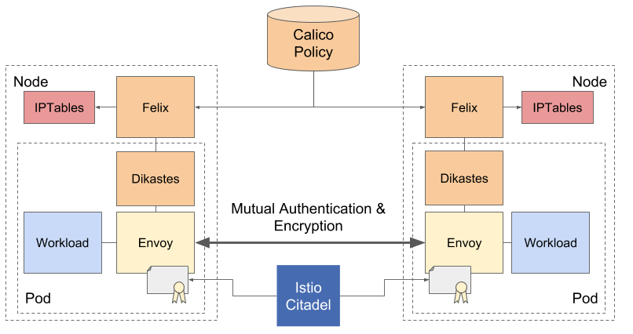

# Application Layer Policy

Application Layer Policy for [Project Calico][calico] enforces network and
application layer authorization policies using [Istio].

Istio mints and distributes cryptographic identities and uses them to establish mutually authenticated TLS connections
between pods.  Calico enforces authorization policy on this communication integrating cryptographic identities and 
network layer attributes.

The `envoy.ext_authz` filter inserted into the proxy, which calls out to Dikastes when service requests are
processed.  We compute policy based on a global store which is distributed to Dikastes by its local Felix.
 
## Getting Started

Application Layer Policy is described in the [Project Calico docs][docs].

 - [Enabling Application Layer Policy](https://docs.projectcalico.org/master/security/app-layer-policy)
 
 
 [calico]: https://projectcalico.org
 [istio]: https://istio.io
 [docs]: https://docs.projectcalico.org/latest
 
