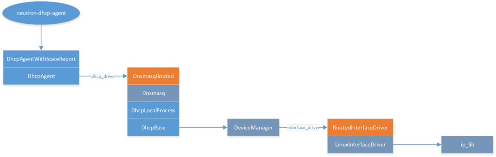

Calico DHCP agent
=================

Design
------

The Calico DHCP agent is implemented in a way that reuses much of the existing
Neutron DHCP agent architecture – including for example its use of Dnsmasq –
but avoids the parts of this that cause excessive load on the Neutron server
when there are more than a few hundred DHCP agents running.  The Neutron DHCP
agent architecture looks like this:

Key

- The ellipse is the top level executable script for the agent.  The rectangles
  are all Python classes, with stacks indicating inheritance.

- Named arrows indicate where config settings can refer to a Calico-specific
  implementation class, and hence cause Calico-specific code to be involved.

- Orange indicates a class provided by networking-calico.  All the others are
  Neutron; orange hashing indicates places where we've had patches upstreamed
  to enable Calico behaviour.

Functional areas

- The Dnsmasq stack is responsible for configuring and running Dnsmasq, and
  keeping its configuration up to date.

- The DeviceManager and InterfaceDriver stacks are responsible for the Linux
  interface that is associated with the subnets for which DHCP addressing is
  being done.  In the Calico case (RoutedInterfaceDriver) this is an unbridged
  Linux dummy interface, and has the gateway IP for each DHCP-enabled subnet.

The Calico DHCP agent replaces just the top level script and Python class, so
the architecture changes to this:

.. figure:: _static/calico-dhcp-agent.png
   :alt: Calico DHCP agent architecture

The key parts of this, that eliminate the Neutron server load problem, are:

- Removal of DhcpAgentWithStateReport – which was what told the Neutron server
  of this agent's existence, and so caused the server to fan out port updates
  to it.

- CalicoDhcpAgent replaces DhcpAgent's run() method.  DhcpAgent.run() would ask
  the Neutron server for port information at start of day, and periodically
  thereafter, so CalicoDhcpAgent's replacement stops this from happening.

Instead, CalicoDhcpAgent watches the /calico/v1/host/<hostname>/workload
subtree, for the local <hostname>, in etcd, and processes any endpoint data
changes for endpoints on <hostname>.  The ‘dhcp_driver' API expects information
about subnets and ports in a particular format (‘NetworkCache'), so
CalicoDhcpAgent's processing just converts the current endpoint data set into
that format, and passes it to the dhcp_driver.

etcd data model changes
-----------------------

In order to provision the Calico DHCP agent from information in etcd, we have
made the following additions to the etcd data model, beyond the information
that was already present and consumed by Felix (the main Calico agent).

- /calico/dhcp/v1: new sub-tree for information needed by the DHCP agent.

- /calico/dhcp/v1/subnet: new directory for subnet information.

- /calico/dhcp/v1/subnet/<subnet-id>: etcd entry with JSON dict content:

::

    {
      'cidr': <cidr>,
      # Mandatory.  For example: “192.168.1.0/24”.

      'gateway_ip': <gateway IP>,
      # Mandatory.  For example: “192.168.1.1”.

      'dns_servers': [ <ip1>, <ip2>, ... ]
      # Optional.  For example: [ '172.18.10.55', '172.18.10.74' ]
    }

- New fields in the JSON dict for each endpoint:

::

    {
      'ipv4_subnet_ids': [ <subnet-id>, ... ]
      # Subnet IDs for each corresponding IPv4 address in 'ipv4_nets'.

      'ipv6_subnet_ids': [ <subnet-id>, ... ]
      # Subnet IDs for each corresponding IPv6 address in 'ipv6_nets'.

      'fqdn': <fdqn>
      # Optional.  E.g. 'calico-vm17.datcon.co.uk'
    }

Note - Subnet prefix lengths
~~~~~~~~~~~~~~~~~~~~~~~~~~~~

The DHCP agent needs correct subnet prefix lengths because:

- for each subnet, the gateway IP and prefix length are defined on the Linux
  interface that Dnsmasq listens on, as 'ifconfig <device> <gateway IP>/<prefix
  length>'

- Dnsmasq will only hand out IP addresses within the subnets defined on the
  associated Linux interface.

Note - VM hostnames
~~~~~~~~~~~~~~~~~~~

Neutron is currently implementing changes to allow a VM's hostname to be the
same as the name chosen for it by the user. This involves two new port fields,
dns_name and dns_assignment, being passed from the Neutron server to the DHCP
agent.

- ‎dns_name is a simple name, like 'calico-vm17'. It is a writable port field,
  and gets combined with a dns_domain that is specified elsewhere.

- dns_assignment is a server-generated read-only field‎, holding a list of dicts
  like {'hostname': 'calico-vm17', 'ip_address': '10.65.0.4', 'fqdn':
  'calico-vm17.datcon.co.uk'}.

- The hostname and fqdn fields are both passed by the DHCP agent to the
  dhcp_driver, which includes them in the Dnsmasq config that it generates.

There isn't actually any requirement for the dns_assignment fields being
per-IP-address, rather than per-host; it was done this way for consistency with
the Dnsmasq config, which also specifies a hostname and fqdn for each IP
address
(http://lists.openstack.org/pipermail/openstack-dev/2015-November/078799.html).

In the Calico model, a single 'fqdn' field is added to endpoint data, e.g.

::

    'fqdn': 'calico-vm17.datcon.co.uk'

and hostname is derived from that by splitting at the first '.'.

Invocation
~~~~~~~~~~

DHCP agent can be invoked in the same way as neutron DHCP agent, using the
neutron configuration file. Note, however, that
calico DHCP agent in addition consumes specific settings (e.g. etcd cluster
connection information) which are provided under option group (in terms of
oslo config) with name 'calico'.

With that said, user who wants to tune the agent to his/her needs may supply
additional configuration files (or modify the neutron one) with the mentioned
option group. As a side effect of this, configuration file for calico ml2
plugin might be used as a such source as it already contains
all sufficient settings.

Here is one of the examples of invocation:

::

    calico-dhcp-agent --config-file /etc/neutron/neutron.conf --config-file /etc/neutron/plugins/ml2/ml2_conf.ini
