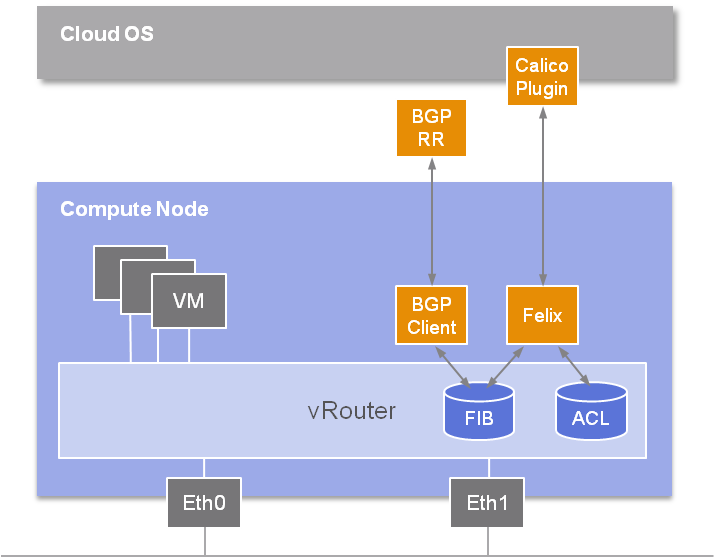

Calico Architecture Overview
============================

Calico was designed from the ground up to be simple, secure, scalable,
and applicable to a range of workload environments including traditional
hypervisors, lightweight containers, and bare metal.

Calico has a relatively simple architecture. Where possible it leverages
existing open source projects – in particular, much of the actual
routing and security enforcement is implemented by the existing Linux
kernel networking subsystem.

The diagram below illustrates Calico and its components.

   Calico Architecture

Neutron Plug-in
^^^^^^^^^^^^^^^

For OpenStack integration, Calico includes a Neutron plug-in.

Felix
^^^^^

The Felix component of Project Calico acts as a forwarding enforcement
point, interfacing with the Linux kernel. It ensures that routes to the
local VMs are programmed into the vRouter’s FIB. It also enforces
security policy, by compiling configured ACL rules and programming them
into the Linux kernel.

vRouter
^^^^^^^

Project Calico uses the native Linux IP forwarding engine as the virtual
router. This supports both:

-  the forwarding of inbound and outbound packets according to rules
   programmed into the kernel by Felix, and
-  enforcement of security policy by the checking of all inbound and
   outbound packets against the access control list (ACL) rules
   programmed into the kernel by Calico.

Developers modifying Calico to target host operating systems other than
Linux, or where data plane acceleration is required (either in software
or hardware), may choose to make use of alternative virtual router
implementations provided they perform these two functions.

BGP Client (BIRD)
^^^^^^^^^^^^^^^^^

In Project Calico we use BIRD as the host’s BGP client, but others could
be adapted to work. For example,

-  Quagga should work (with appropriate configuration scripts)
-  Metaswitch plans to offer commercially supported distributions
   including Metaswitch’s own DC-BGP stack.

BGP Route Reflector
^^^^^^^^^^^^^^^^^^^

Optionally, for scalability, you may choose to deploy Calico with a BGP
route reflector. This is not part of the base Project Calico
distribution, but could be implemented with any number of
hardware-based, open source or commercial software solutions including
BIRD, Quagga, and Metaswitch’s AX1000 Virtual Route Reflector.

Interconnect Infrastructure
^^^^^^^^^^^^^^^^^^^^^^^^^^^

The only requirement of the infrastructure that interconnects the
vRouter nodes (the compute servers) is that it can carry L3 packets
between routers. It could be a Layer 2 (Ethernet) network, an MPLS
network, or an L3 routed network.

Typically, however, there will be some form of L2 Ethernet network that
will interconnect the vRouters within a single domain (say a pod or a
data center), and an L3 network that interconnects those domains.

It is important to note, in the case of an L2 network, that that network
is only learning and connecting the fairly static collection of
vRouters, *not* the actual end-points (guests or VNFCis) in the network.
The number of MAC addresses is equivalent to the number of compute
servers in the cloud, and the topology will rarely change.

Furthermore, the vRouters can leverage equal-cost multi-path routing
(ECMP) to allow for load-distribution at the vRouter level, rather than
at the top of rack switch. You could have 2 (or more) “leaf-spine”
networks, and each of those networks would be connected to each vRouter.
The vRouters would then learn, and distribute traffic evenly over each
of those “planes” of leaf-spine backbone.

However, the fundamental point is that Project Calico will work with any
network technology or topology that will transport L3 packets. Hence, it
places minimal demands on the physical infrastructure, allowing for use
of the most cost-effective switching hardware.

