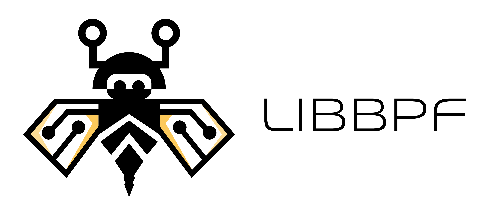

<picture>
  <source media="(prefers-color-scheme: dark)" srcset="assets/libbpf-logo-sideways-darkbg.png" width="40%">
  
</picture>

libbpf
[](https://github.com/libbpf/libbpf/actions/workflows/test.yml)
[](https://scan.coverity.com/projects/libbpf)
[](https://github.com/libbpf/libbpf/actions?query=workflow%3ACodeQL+branch%3Amaster)
[](https://oss-fuzz-build-logs.storage.googleapis.com/index.html#libbpf)
[](https://libbpf.readthedocs.io/en/latest/)
======

**This is the official home of the libbpf library.**

*Please use this Github repository for building and packaging libbpf
and when using it in your projects through Git submodule.*

Libbpf *authoritative source code* is developed as part of [bpf-next Linux source
tree](https://kernel.googlesource.com/pub/scm/linux/kernel/git/bpf/bpf-next) under
`tools/lib/bpf` subdirectory and is periodically synced to Github. As such, all the
libbpf changes should be sent to [BPF mailing list](http://vger.kernel.org/vger-lists.html#bpf),
please don't open PRs here unless you are changing Github-specific parts of libbpf
(e.g., Github-specific Makefile).

Libbpf and general BPF usage questions
======================================

Libbpf documentation can be found [here](https://libbpf.readthedocs.io/en/latest/api.html).
It's an ongoing effort and has ways to go, but please take a look and consider contributing as well.

Please check out [libbpf-bootstrap](https://github.com/libbpf/libbpf-bootstrap)
and [the companion blog post](https://nakryiko.com/posts/libbpf-bootstrap/) for
the examples of building BPF applications with libbpf.
[libbpf-tools](https://github.com/iovisor/bcc/tree/master/libbpf-tools) are also
a good source of the real-world libbpf-based tracing tools.

See also ["BPF CO-RE reference guide"](https://nakryiko.com/posts/bpf-core-reference-guide/)
for the coverage of practical aspects of building BPF CO-RE applications and
["BPF CO-RE"](https://nakryiko.com/posts/bpf-portability-and-co-re/) for
general introduction into BPF portability issues and BPF CO-RE origins.

All general BPF questions, including kernel functionality, libbpf APIs and
their application, should be sent to bpf@vger.kernel.org mailing list. You can
subscribe to it [here](http://vger.kernel.org/vger-lists.html#bpf) and search
its archive [here](https://lore.kernel.org/bpf/). Please search the archive
before asking new questions. It very well might be that this was already
addressed or answered before.

bpf@vger.kernel.org is monitored by many more people and they will happily try
to help you with whatever issue you have. This repository's PRs and issues
should be opened only for dealing with issues pertaining to specific way this
libbpf mirror repo is set up and organized.

Building libbpf
===============
libelf is an internal dependency of libbpf and thus it is required to link
against and must be installed on the system for applications to work.
pkg-config is used by default to find libelf, and the program called can be
overridden with `PKG_CONFIG`.

If using `pkg-config` at build time is not desired, it can be disabled by
setting `NO_PKG_CONFIG=1` when calling make.

To build both static libbpf.a and shared libbpf.so:
```bash
$ cd src
$ make
```

To build only static libbpf.a library in directory
build/ and install them together with libbpf headers in a staging directory
root/:
```bash
$ cd src
$ mkdir build root
$ BUILD_STATIC_ONLY=y OBJDIR=build DESTDIR=root make install
```

To build both static libbpf.a and shared libbpf.so against a custom libelf
dependency installed in /build/root/ and install them together with libbpf
headers in a build directory /build/root/:
```bash
$ cd src
$ PKG_CONFIG_PATH=/build/root/lib64/pkgconfig DESTDIR=/build/root make install
```

BPF CO-RE (Compile Once – Run Everywhere)
=========================================

Libbpf supports building BPF CO-RE-enabled applications, which, in contrast to
[BCC](https://github.com/iovisor/bcc/), do not require Clang/LLVM runtime
being deployed to target servers and doesn't rely on kernel-devel headers
being available.

It does rely on kernel to be built with [BTF type
information](https://www.kernel.org/doc/html/latest/bpf/btf.html), though.
Some major Linux distributions come with kernel BTF already built in:
  - Fedora 31+
  - RHEL 8.2+
  - OpenSUSE Tumbleweed (in the next release, as of 2020-06-04)
  - Arch Linux (from kernel 5.7.1.arch1-1)
  - Manjaro (from kernel 5.4 if compiled after 2021-06-18)
  - Ubuntu 20.10
  - Debian 11 (amd64/arm64)

If your kernel doesn't come with BTF built-in, you'll need to build custom
kernel. You'll need:
  - `pahole` 1.16+ tool (part of `dwarves` package), which performs DWARF to
    BTF conversion;
  - kernel built with `CONFIG_DEBUG_INFO_BTF=y` option;
  - you can check if your kernel has BTF built-in by looking for
    `/sys/kernel/btf/vmlinux` file:
  
```shell
$ ls -la /sys/kernel/btf/vmlinux
-r--r--r--. 1 root root 3541561 Jun  2 18:16 /sys/kernel/btf/vmlinux
```
  
To develop and build BPF programs, you'll need Clang/LLVM 10+. The following
distributions have Clang/LLVM 10+ packaged by default:
  - Fedora 32+
  - Ubuntu 20.04+
  - Arch Linux
  - Ubuntu 20.10 (LLVM 11)
  - Debian 11 (LLVM 11)
  - Alpine 3.13+

Otherwise, please make sure to update it on your system.

The following resources are useful to understand what BPF CO-RE is and how to
use it:
- [BPF CO-RE reference guide](https://nakryiko.com/posts/bpf-core-reference-guide/)
- [BPF Portability and CO-RE](https://nakryiko.com/posts/bpf-portability-and-co-re/)
- [HOWTO: BCC to libbpf conversion](https://nakryiko.com/posts/bcc-to-libbpf-howto-guide/)
- [libbpf-tools in BCC repo](https://github.com/iovisor/bcc/tree/master/libbpf-tools)
  contain lots of real-world tools converted from BCC to BPF CO-RE. Consider
  converting some more to both contribute to the BPF community and gain some
  more experience with it.

Distributions
=============

Distributions packaging libbpf from this mirror:
  - [Fedora](https://src.fedoraproject.org/rpms/libbpf)
  - [Gentoo](https://packages.gentoo.org/packages/dev-libs/libbpf)
  - [Debian](https://packages.debian.org/source/sid/libbpf)
  - [Arch](https://archlinux.org/packages/core/x86_64/libbpf/)
  - [Ubuntu](https://packages.ubuntu.com/source/jammy/libbpf)
  - [Alpine](https://pkgs.alpinelinux.org/packages?name=libbpf)

Benefits of packaging from the mirror over packaging from kernel sources:
  - Consistent versioning across distributions.
  - No ties to any specific kernel, transparent handling of older kernels.
    Libbpf is designed to be kernel-agnostic and work across multitude of
    kernel versions. It has built-in mechanisms to gracefully handle older
    kernels, that are missing some of the features, by working around or
    gracefully degrading functionality. Thus libbpf is not tied to a specific
    kernel version and can/should be packaged and versioned independently.
  - Continuous integration testing via
    [GitHub Actions](https://github.com/libbpf/libbpf/actions).
  - Static code analysis via [LGTM](https://lgtm.com/projects/g/libbpf/libbpf)
    and [Coverity](https://scan.coverity.com/projects/libbpf).

Package dependencies of libbpf, package names may vary across distros:
  - zlib
  - libelf

[](https://repology.org/project/libbpf/versions)


bpf-next to Github sync
=======================

All the gory details of syncing can be found in `scripts/sync-kernel.sh`
script. See [SYNC.md](SYNC.md) for instruction.

Some header files in this repo (`include/linux/*.h`) are reduced versions of
their counterpart files at
[bpf-next](https://git.kernel.org/pub/scm/linux/kernel/git/bpf/bpf-next.git/)'s
`tools/include/linux/*.h` to make compilation successful.

License
=======

This work is dual-licensed under BSD 2-clause license and GNU LGPL v2.1 license.
You can choose between one of them if you use this work.

`SPDX-License-Identifier: BSD-2-Clause OR LGPL-2.1`
