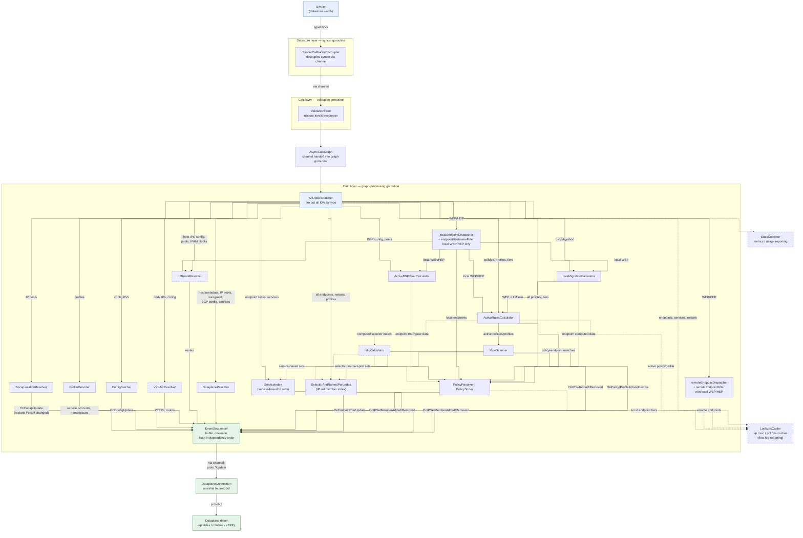

<!--
Copyright (c) 2026 Tigera, Inc. All rights reserved.

Licensed under the Apache License, Version 2.0 (the "License");
you may not use this file except in compliance with the License.
You may obtain a copy of the License at

    http://www.apache.org/licenses/LICENSE-2.0

Unless required by applicable law or agreed to in writing, software
distributed under the License is distributed on an "AS IS" BASIS,
WITHOUT WARRANTIES OR CONDITIONS OF ANY KIND, either express or implied.
See the License for the specific language governing permissions and
limitations under the License.
-->

# Felix calculation graph — node overview

Hand-maintained overview of the calc-graph nodes and how they are wired,
assembled in [`felix/calc/calc_graph.go`](../calc/calc_graph.go)
(`NewCalculationGraph`). Update it when you add or rewire a node.

For the design rationale, invariants and review criteria, see
[`felix/design/calc-graph.md`](../design/calc-graph.md). For the output
contract (the protobuf messages emitted to the dataplane) see
[`dataplane.md` → The dataplane API](../design/dataplane.md#the-dataplane-api-calc-graph--dataplane-contract).

Nodes drawn with a dashed border are created conditionally (encap mode,
BPF, Istio ambient, lookup cache, etc.). Edge labels name the resource
types or callbacks that flow along each edge; they are illustrative, not
exhaustive.

