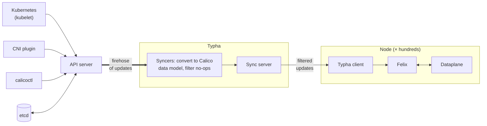

<!--
Copyright (c) 2026 Tigera, Inc. All rights reserved.

Licensed under the Apache License, Version 2.0 (the "License");
you may not use this file except in compliance with the License.
You may obtain a copy of the License at

    http://www.apache.org/licenses/LICENSE-2.0
-->

# Typha — Architecture & Design Index

Typha is a fan-out proxy for the
[Syncer API](../design/syncer/DESIGN.md). It watches the
datastore once — running one syncer per supported type — caches
the resulting key/value state, and streams it to many clients
(Felix, confd, `node` helpers) over TCP. Each client gets a
stream equivalent to an in-process syncer's — Typha may reorder
and coalesce, but the Syncer API is eventually consistent, so the
callbacks are identical and client code doesn't know Typha is
there.

This document has two parts:

1. **Architecture overview** — the shape of Typha as a whole.
2. **Sub-design index** — per-topic design docs under
   [`typha/design/`](./design/) with a path-to-doc mapping.
   Invariants and review criteria live in the sub-designs, not
   here.

## 1. Architecture overview

### Why Typha exists

With etcd as the datastore, every component watching the
datastore directly worked at high scale. With the Kubernetes API
server it did not: Calico's Node resource is backed by the
built-in Kubernetes Node resource, which every kubelet updates
every few seconds, so every watcher receives every kubelet
heartbeat — O(n²) events in the number of nodes, 99.9% of them
irrelevant to Calico. The API server struggled beyond ~50–100
nodes.

Typha fixes this by:

- running **one** copy of each syncer type, so the API server
  sees a handful of watchers instead of one per node per type;
- **filtering out no-op updates** after conversion to the Calico
  data model, so kubelet heartbeats never reach the clients;
- exposing a **remote version of the Syncer API** so clients need
  only minimal changes — the same callbacks, delivered over TCP.

Keeping the Syncer API and its invariants unchanged is what made
Typha cheap to introduce — and it remains a design constraint:
Typha's output must be a valid Syncer stream. The scope is
deliberately narrow: Typha only proxies the Syncer API; clients
still contact the API server directly for everything else
(writes, and reading the config needed to find Typha in the first
place).



### Data flow

```
Datastore syncers (one per SyncerType)
   → SyncerCallbacksDecoupler
   → ValidationFilter (Felix pipeline also: NodeCounter)
   → SyncerCallbacksDecoupler
   → snapcache.Cache ("breadcrumb" snapshot+deltas cache)
   → syncserver.Server
   → per-connection goroutines → TCP/TLS → clients
```

The daemon (`pkg/daemon/daemon.go`) builds one such pipeline per
`SyncerType` (`felix`, `bgp`, `tunnel-ip-allocation`,
`node-status` — see `pkg/syncproto`). Each connecting client asks
for one syncer type in its handshake and is attached to that
pipeline's cache.

The two design centrepieces:

- **The breadcrumb cache** (`pkg/snapcache`): a copy-on-write
  B-tree of the datastore state. After each batch of updates the
  cache publishes a "Breadcrumb" — an O(1) snapshot of the tree
  plus the deltas since the previous crumb — onto a linked list.
  A new client sends the current crumb's snapshot, then follows
  the list, sending only deltas; the cache's writer never blocks
  on slow clients.
- **Shared serialization**: KVs are serialized once, in the
  cache, not per client. When many clients connect at once, the
  whole compressed snapshot byte-stream is also generated once
  and shared (`pkg/syncserver/snap_precalc.go`).

Key orientation files: `pkg/daemon/daemon.go`,
`pkg/snapcache/cache.go`, `pkg/syncserver/sync_server.go`,
`pkg/syncproto/sync_proto.go` (protocol doc comment),
`pkg/syncclient/sync_client.go`.

### Deployment shape

Typha runs as a Deployment (Linux-only), typically sized at
roughly one replica per 100–200 nodes (a conservative figure;
one Typha can serve several hundred clients). Clients discover
Typha instances via the Kubernetes EndpointSlices of the
`calico-typha` Service and pick one at random (preferring a
Typha on their own node — see
[`client.md`](./design/client.md)). Load-balancing across
replicas is server-driven: each Typha computes a fair-share
connection cap from the node and Typha counts and sheds random
connections when over it (see [`server.md`](./design/server.md)).
Replica count is managed outside this repo (tigera/operator);
there is no autoscaler in the monorepo.

## 2. Sub-design index

Per-topic design docs under [`typha/design/`](./design/). Each is
the authoritative source for its area's architecture, invariants,
and review notes. A PR that touches files across multiple
"applies to" scopes must load every matching sub-design.

| Topic | Applies to | Status |
|---|---|---|
| [protocol](./design/protocol.md) — wire protocol, handshake, compression, version skew | `typha/pkg/syncproto/**` (and any change to what goes on the wire) | ✅ exists |
| [server](./design/server.md) — daemon pipeline, breadcrumb cache, sync server, connection management | `typha/pkg/daemon/**`, `typha/pkg/calc/**`, `typha/pkg/snapcache/**`, `typha/pkg/syncserver/**`, `typha/pkg/k8s/**`, `typha/pkg/config/**` | ✅ exists |
| [client](./design/client.md) — client library, discovery, reconnection | `typha/pkg/syncclient/**`, `typha/pkg/discovery/**`, `typha/pkg/syncclientutils/**`, `typha/pkg/tlsutils/**` | ✅ exists |

Cross-cutting:

- The Syncer API contract Typha proxies:
  [`design/syncer/DESIGN.md`](../design/syncer/DESIGN.md).
- The consumer side in Felix:
  [`felix/design/calc-graph.md`](../felix/design/calc-graph.md).
- Combined `calico` binary, health reporting, build system: root
  [`DESIGN.md`](../DESIGN.md).

## 3. For coding agents and reviewers

- **Follow links.** Sub-designs reference siblings, the shared
  syncer design, and code. A design is a graph, not a single
  node.
- **Review notes are the checklist.** Each sub-design embeds
  per-section review notes; respect them at write-time, apply
  them at review-time.
- **Update rule.** A change to how Typha works — its pipeline,
  cache semantics, wire protocol, connection management,
  discovery, or any documented invariant — must update the
  relevant sub-design (and this index if the table or overview
  changes) in the same PR. Exemptions: bug fix restoring
  documented behaviour, mechanical refactor, comment/log edits,
  dependency bumps. If in doubt, update.
- **Tests run under plain `go test`/ginkgo.** All Typha tests,
  including the FV suite (`typha/fv-tests/`), run in-process with
  no containers.
