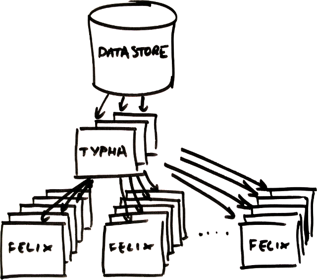

[](https://semaphoreci.com/calico/typha)
[](https://coveralls.io/github/projectcalico/typha?branch=master)
[](https://slack.projectcalico.org)
[](https://kiwiirc.com/client/irc.freenode.net/#calico)
[](https://goreportcard.com/report/github.com/projectcalico/typha)
# Project Calico

<!--
<blockquote>
Note that the documentation in this repo is targeted at Calico contributors.
<h1>Documentation for Calico users is here:<br><a href="http://docs.projectcalico.org">http://docs.projectcalico.org</a></h1>
</blockquote>
-->

This repository contains the source code for Project Calico's optional Typha daemon.  An instance of Typha sits
between the datastore (such as the Kubernetes API server) and many instances of Felix.



This has many advantages:

- Since one Typha instance can support hundreds of Felix instances, it reduces the load on the datastore
  by a large factor.

- Since Typha can filter out updates that are not relevant to Felix, it also reduces Felix's
  CPU usage.  In a high-scale (100+ node) Kubernetes cluster, this is _essential_ because the
  number of updates generated by the API server scales with the number of nodes.

## When should I use Typha?

We recommend always using Typha when you are using the Kubernetes API datastore.
However, Typha is strictly necessary when you are using the Kubernetes API datastore
with a cluster greater than 50 nodes.

Typha is generally not required for Calico deployments using an etcdv3 datastore directly.

## How can I start using Typha?

Follow the "more than 50 nodes" section in the
[Calico for Kubernetes getting started guide](https://docs.projectcalico.org/getting-started/kubernetes/self-managed-onprem/onpremises).

## How can I get support for contributing to Project Calico?

The best place to ask a question or get help from the community is the
[calico-users #slack](https://slack.projectcalico.org).  We also have
[an IRC channel](https://kiwiirc.com/client/irc.freenode.net/#calico).

## Who is behind Project Calico?

[Tigera, Inc.](https://www.tigera.io/) is the company behind Project Calico
and is responsible for the ongoing management of the project. However, it
is open to any members of the community – individuals or organizations –
to get involved and contribute code.

## Contributing

Thanks for thinking about contributing to Project Calico! The success of an
open source project is entirely down to the efforts of its contributors, so we
do genuinely want to thank you for even thinking of contributing.

Before you do so, you should check out our contributing guidelines in the
`CONTRIBUTING.md` file, to make sure it's as easy as possible for us to accept
your contribution.

## How do I build Typha?

Typha mostly uses Docker for builds.  We develop on Ubuntu 16.04 but other
Linux distributions should work (there are known Makefile that prevent building on OS X).
To build Typha, you will need:

- A suitable linux box.
- To check out the code into your GOPATH.
- Docker >=1.12
- GNU make.

Then, as a one-off, run
```
make update-tools
```
which will install a couple more go tools that we haven't yet containerised.

Then, to build the calico-typha binary:
```
make bin/calico-typha
```
or, the `calico/typha` docker image:
```
make image
```

## How can I run Typha's unit tests?

To run all the UTs:
```
make ut
```

To start a `ginkgo watch`, which will re-run the relevant UTs as you update files:
```
make ut-watch
```

To get coverage stats:
```
make cover-report
```
or
```
make cover-browser
```

## How can I run a subset of the Go unit tests?

If you want to be able to run unit tests for specific packages for more iterative
development, you'll need to install

- GNU make
- go >=1.7

then run `make update-tools` to install ginkgo, which is the test tool used to
run Typha's unit tests.

There are several ways to run ginkgo.  One option is to change directory to the
package you want to test, then run `ginkgo`.  Another is to use ginkgo's
watch feature to monitor files for changes:
```
cd go
ginkgo watch -r
```
Ginkgo will re-run tests as files are modified and saved.

## How do I build packages/run Typha?

### Docker

After building the docker image (see above), you can run Typha and log to screen
with, for example:
`docker run --privileged --net=host -e TYPHA_LOGSEVERITYSCREEN=INFO calico/typha`

## License

Calico binaries are licensed under the [Apache v2.0 license](LICENSE), with the exception of some [GPL licensed eBPF programs](https://github.com/projectcalico/felix/tree/master/bpf-gpl).

Calico imports packages with a number of apache-compatible licenses. For more information, see [filesystem/licenses](./filesystem/licenses). In addition, the base container image contains
pre-packaged software with a variety of licenses.
