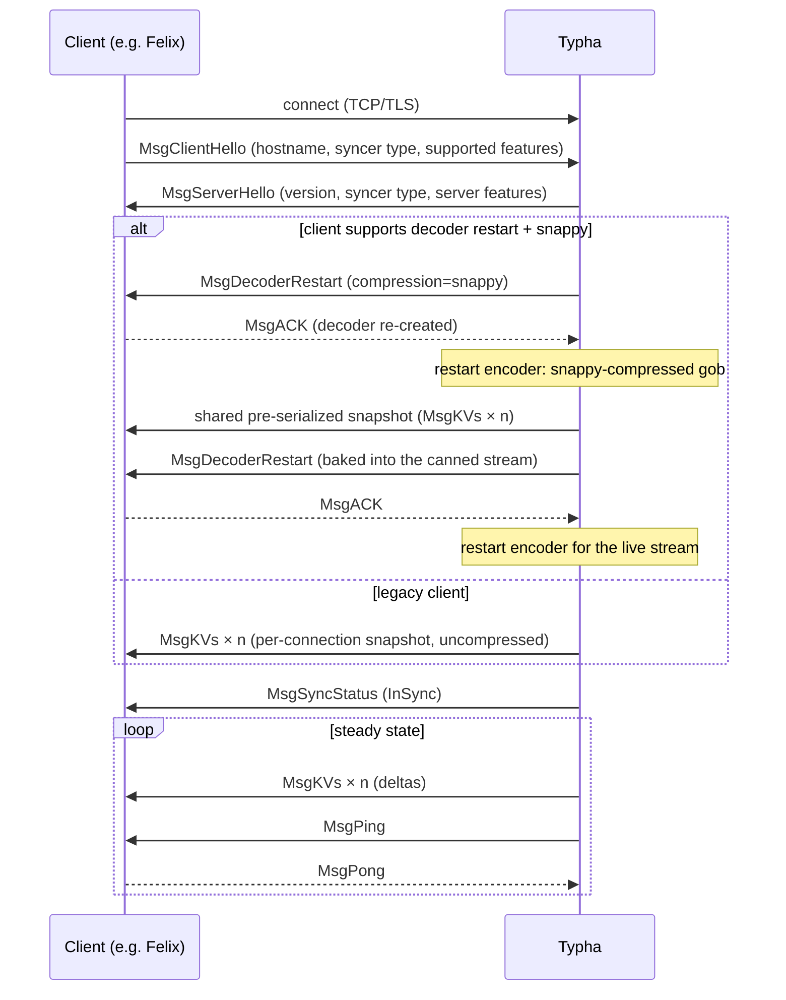

<!--
Copyright (c) 2026 Tigera, Inc. All rights reserved.

Licensed under the Apache License, Version 2.0 (the "License");
you may not use this file except in compliance with the License.
You may obtain a copy of the License at

    http://www.apache.org/licenses/LICENSE-2.0
-->

# Typha wire protocol

Applies to: `typha/pkg/syncproto/**` — and to any change, on
either side, to what goes on the wire.

The protocol is defined (structs and a long design comment) in
`typha/pkg/syncproto/sync_proto.go`. This doc covers the same
ground at design level: the handshake, the encoding choices and
their consequences, and the version-skew rules. The server and
client implementations are covered in [`server.md`](./server.md)
and [`client.md`](./client.md).

## Shape of the protocol

The client opens a TCP connection (default port 5473, usually
TLS — see [`client.md`](./client.md)) and the two sides exchange
gob-encoded messages, each wrapped in an `Envelope` struct to
simplify decoding. The client speaks first (`MsgClientHello`);
after the server's `MsgServerHello`, the stream is almost
entirely server→client: a complete snapshot of the datastore as
`MsgKVs` messages, `MsgSyncStatus` when the status changes
(typically `InSync` once the snapshot is done), then a live feed
of further `MsgKVs`/`MsgSyncStatus`. The only steady-state
client→server traffic is `MsgPong` replying to the server's
periodic `MsgPing`.

There is no goodbye message: either side disconnects by closing
the connection, and the client treats any disconnection the same
way (reconnect and resync — see [`client.md`](./client.md)).

The handshake also selects the stream contents: `MsgClientHello`
names a `SyncerType` (`felix`, `bgp`, `tunnel-ip-allocation`,
`node-status`; unset means `felix`, for old clients) and the
server attaches the connection to that type's pipeline.

## KV encoding: gob envelope, "default path" key, JSON value

Key/value pairs are not gob-encoded as Go structs. Each is a
`SerializedUpdate`: the key flattened to its libcalico-go
"default path" string (`model.KeyToDefaultPath` — the etcd key
format) and the value serialized to JSON (`model.SerializeValue`
— the etcd value format), plus the syncer metadata (revision,
update type, TTL). The rationale, from the package comment:

1. it avoids any subtle incompatibility between our datamodel
   and gob;
2. it removes the need to register all our datatypes with the
   gob en/decoder;
3. it re-uses known-good serialization code with known semantics
   around data-model upgrade (the JSON marshaller's treatment of
   added/removed fields);
4. it allows each KV pair to be serialized **once** and sent to
   all listening clients — not easy in raw gob, because a gob
   connection is stateful.

Point 4 is the load-bearing one: the cache stores
`SerializedUpdate`s, so per-client work is fan-out, not
serialization (see [`server.md`](./server.md)).

Two subtleties of `SerializedUpdate`:

- **Dedupe vs v3 metadata.** Typha suppresses updates that don't
  change the value (`WouldBeNoOp`) — this is how kubelet's
  node-heartbeat churn dies at Typha rather than fanning out.
  v3 resources carry their resource version *inside* the object,
  which would defeat the value comparison, so `SerializeUpdate`
  moves it out into the `V3ResourceVersion` field before
  serializing.
- **Historical note: gob.** Gob was chosen for ease of use early
  on. In hindsight its habit of sending type information inline,
  per connection, defeats optimisations we later wanted (splicing
  pre-encoded streams — see below); protobuf wrappers or
  NDJSON/CBOR would be cleaner. We keep gob for compatibility;
  the decoder-restart mechanism is the escape hatch to a future
  protocol.

## Feature negotiation and decoder restart

Gob defaults unknown fields to their zero value, so feature
negotiation is just booleans in the Hello messages: if the peer
didn't say `SupportsFeatureX: true`, you see `false`. Sending a
message *type* the peer doesn't know, however, makes its decoder
return an error and kills the connection — hence the cardinal
rule below.

The one thing simple negotiation can't do is change the encoding
mid-stream, because gob is stateful: it assigns per-connection
type IDs, so you cannot splice one gob stream after another —
the receiver rejects the duplicate type info or misparses. This
blocked the obvious "serialize the snapshot once, replay the
bytes to every client" optimisation, and is why the protocol has
`MsgDecoderRestart`/`MsgACK`:

- `MsgDecoderRestart` tells the client to drain and discard its
  decoder and build a fresh one with the parameters in the
  message (currently just `CompressionAlgorithm`).
- The client replies `MsgACK` **before** the server sends any
  data in the new format. This ordering is mandatory: an
  un-restarted decoder may eagerly buffer bytes it can't parse.

The server uses this twice per modern connection (see diagram):
once after the handshake to switch to compressed gob, and once
more at the end of the shared snapshot — the canned snapshot is a
self-contained gob+snappy byte stream generated once and replayed
verbatim to every concurrently-connecting client, so each
client's decoder must be reset around it. In principle the same
mechanism can upgrade to an entirely different encoding.

Compression is snappy (negotiated via
`SupportedCompressionAlgorithms`; in prototyping it cut bandwidth
4–5× for <10% CPU). It's a pass-through `Writer`; the only
subtlety is that output must be explicitly flushed to reach the
client.

## Version skew and upgrading the datamodel

Typha parses resources and then re-serializes them, so a mixed
Typha/client version pair effectively intersects their
datamodels. The package comment spells out the cases; in brief:

- **New field:** stripped at parse time by whichever side is
  older; behaviour degrades to old-Felix behaviour, provided the
  field was added in a back-compatible way.
- **New resource type:** old Typha won't send it (client must
  tolerate absence); old client fails to parse it, and the client
  code drops the KV with a rate-limited log.
- **Replacing one synthesized resource with another** does *not*
  work across skew — the new one is stripped, the old one no
  longer sent. That needs handshake gating.

Two hard rules fall out of Typha's pass-through role:

- **Typha must not transform values** — parse, validate,
  re-serialize, nothing else — without a deliberate version-skew
  design and a good reason. Felix config is especially prone:
  Felix restarts itself when its config "changes", so Typha must
  deliver exactly the config Felix would have loaded itself, or
  a Typha upgrade triggers a fleet-wide Felix restart loop.
- **Synthesized resources must round-trip.** Resources
  synthesized by the Kubernetes datastore driver are never
  written to etcd, but they still travel the Typha wire, so they
  must serialize/deserialize like everything else.

## Review notes

- **Never send a message type (or enum value with new
  semantics) the peer hasn't advertised support for.** New
  message types need a `Supports…` field in the Hello and a
  check before sending. The two hard-reject examples of the
  inverse — server refusing clients without
  `SupportsModernPolicyKeys`, client refusing servers without
  `SupportsNodeResourceUpdates` — are deliberate, documented
  minimum-version gates.
- **`gob.RegisterName` names are frozen** — they use the
  pre-monorepo `github.com/projectcalico/typha/...` paths so that
  refactors don't break the wire format. Never "fix" them, and
  register new message types the same way.
- **No new-format bytes before the `MsgACK`** when restarting
  the decoder, and the server must hold off pings while waiting
  for the ACK (the pinger writes to the same stream).
- A change to `SerializedUpdate` fields or to `WouldBeNoOp` is a
  change to the dedupe and version-skew behaviour — think
  through both upgrade directions, and remember `WouldBeNoOp`
  must keep ignoring revision-only changes or the kubelet
  heartbeat suppression breaks.
- A datamodel change that renames/re-keys resources needs the
  "upgrading the datamodel" cases in `sync_proto.go` walked
  through explicitly in the PR.

## Keep this doc in sync

A PR that changes the wire protocol — messages, handshake,
encoding, negotiation, or version-skew behaviour — must update
this file (and the doc comment in `sync_proto.go`, which is the
symbol-level source of truth) in the same PR.
