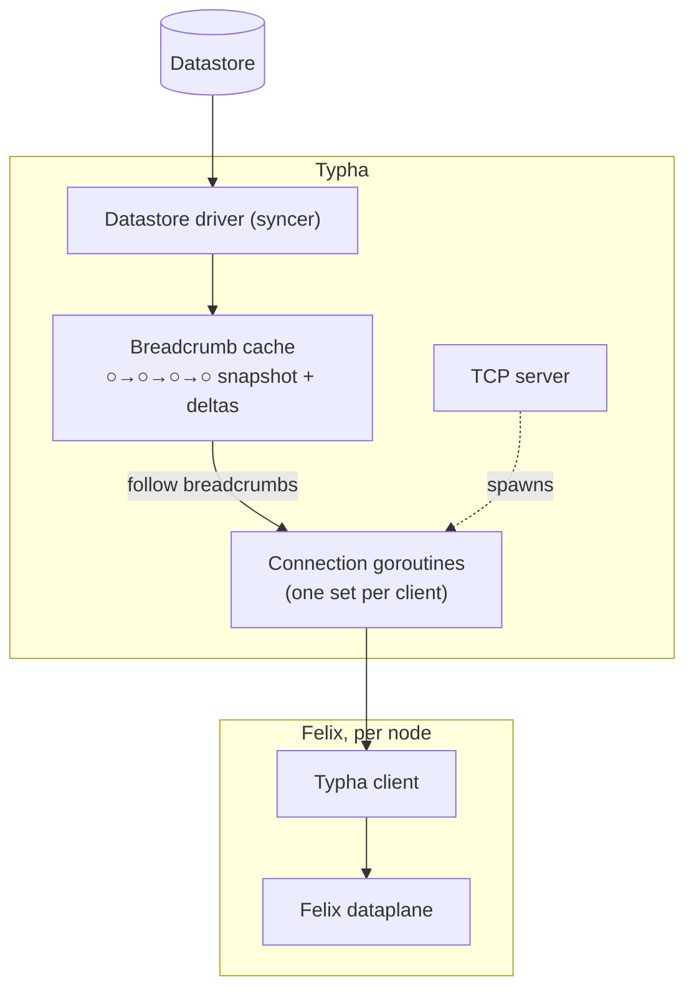

<!--
Copyright (c) 2026 Tigera, Inc. All rights reserved.

Licensed under the Apache License, Version 2.0 (the "License");
you may not use this file except in compliance with the License.
You may obtain a copy of the License at

    http://www.apache.org/licenses/LICENSE-2.0
-->

# Typha server

Applies to: `typha/pkg/daemon/**`, `typha/pkg/calc/**`,
`typha/pkg/snapcache/**`, `typha/pkg/syncserver/**`,
`typha/pkg/k8s/**`, `typha/pkg/config/**`.

The server side of Typha is a pipeline from the datastore to many
TCP connections:



The interesting design problem is in the middle: a new client
needs the *whole* datastore snapshot (hundreds of thousands of
KVs in a big cluster) while the update stream keeps flowing
(bursts of ~1,000 updates/s), and hundreds of clients may connect
at once. The breadcrumb cache and the shared binary snapshot are
the two mechanisms that make that cheap.

## The daemon and its pipelines

`daemon.TyphaDaemon` (`pkg/daemon/daemon.go`) loads config
(Felix-style env-var/file layering, `pkg/config`), connects to
the datastore (retrying forever — Typha is useless without it),
and builds one pipeline per `SyncerType`, eagerly:

```
syncer → SyncerCallbacksDecoupler → ValidationFilter
       [→ NodeCounter, felix pipeline only]
       → SyncerCallbacksDecoupler → snapcache.Cache
```

- The syncers come from `libcalico-go/lib/backend/syncersv1/`
  (see [`design/syncer/DESIGN.md`](../../design/syncer/DESIGN.md)
  for the API contract, which each pipeline stage must preserve).
- `calc.SyncerCallbacksDecoupler` moves the stream onto another
  goroutine via an **unbuffered** channel. That's deliberate:
  it buys pipeline parallelism (downstream can process one batch
  while upstream produces the next) but no queueing — if the
  cache is busy, backpressure reaches the syncer immediately,
  and the backlog accumulates in the datastore watcher, which
  can coalesce it.
- `calc.ValidationFilter` validates each value and **nils out
  invalid ones** (treating them as deletions) rather than
  dropping batches or passing garbage on. One bad resource in
  the datastore must not take out every Felix. (Felix runs an
  equivalent `ValidationFilter` in `felix/calc`, so the
  direct-datastore path behaves the same.)
- `calc.NodeCounter` (felix pipeline only) counts Node resources
  in passing; the connection governor uses it (below).

The caches are handed to a single `syncserver.Server`, which
routes each connection to the cache matching the `SyncerType`
requested in its handshake.

### Review notes

- A new pipeline stage sits inside the Syncer API contract: it
  must preserve deletions, keep `UpdateType` sequences coherent,
  and must not reorder a key's updates. Its output must be a
  **safe approximation** of its input: eliding intermediate
  states is fine, claiming more than it knows is not.
- Don't add buffering to the decouplers "for throughput" — the
  no-queue backpressure is a design choice; queues here just move
  the backlog somewhere it can't be coalesced.
- `ValidationFilter` must alter values only to `nil` — never
  "fix up" a value (see the pass-through rule in
  [`protocol.md`](./protocol.md)).

## The breadcrumb cache (`pkg/snapcache`)

The obvious cache — a big map guarded by a mutex — fails at
scale: sending (or copying) a 500k-entry snapshot to a new client
while holding the lock starves the writer. The design comment on
`snapcache.Cache` is the canonical statement of the scheme used
instead:

- The cache's single main goroutine applies updates to a
  **copy-on-write B-tree** whose entries are already-serialized
  KVs (`syncproto.SerializedUpdate` — serialize once, fan out
  many times; see [`protocol.md`](./protocol.md)).
- After each batch (up to `MaxBatchSize`, default 100) it
  publishes a **`Breadcrumb`**: an O(1) clone of the tree (the
  point-in-time snapshot) plus the batch's deltas, appended to a
  linked list of crumbs and announced on a single condition
  variable.
- Each client-handling goroutine looks after itself: it takes
  the current crumb, sends its snapshot, then follows the `next`
  pointers, sending only deltas. Following the list is a
  non-blocking atomic-pointer walk; a client only touches the
  condition variable when it has fully caught up. The writer
  never waits for readers.

The design comment also records why *not* per-client channels:
the bookkeeping to avoid one slow client blocking the rest
(skipping, per-channel progress tracking) is fiddlier than
letting each client walk an immutable list at its own pace.
(And why a B-tree: originally this was a C-trie, chosen for its
off-the-shelf snapshot API; C-tries optimise concurrent writes we
don't need, and the simpler B-tree measured faster.)

The cache massages the stream so that what a late-joining client
sees is still a valid syncer stream:

- Snapshot entries are rewritten to `UpdateTypeKVNew` — for a
  new client every KV *is* new — while deltas keep their real
  type, keeping downstream stats eventually consistent.
- No-op updates (same value, different revision) are dropped;
  this is where the kubelet-heartbeat firehose dies.
- Deletions are forwarded even when the tree doesn't hold the
  key. Update types are minted upstream (the `watchersyncer`'s
  per-key cache) against the **raw** view; the tree holds the
  **validated** view, from which `ValidationFilter`'s nil-ing of
  an invalid value drops the key. A real deletion can therefore
  arrive for a tree-absent key, and downstream `New`/`Deleted`
  refcounts (Felix's stats collector) only stay balanced if it is
  passed through.
- `InSync` is only attached to the **last** crumb of a batch —
  a mid-batch crumb doesn't yet reflect everything the syncer
  told us, and claiming in-sync early would trigger premature
  dataplane programming in Felix.

### Review notes

- The publish ordering is load-bearing: the old crumb's `next`
  pointer and the cache's current-crumb pointer are both set
  under the condition-variable lock, `next` first, so a reader
  that sees the new head can always walk to it from an older
  crumb. Don't reorder, and don't touch a published crumb — every
  field is immutable once the crumb is visible.
- Nothing may block the cache's main goroutine: no locks shared
  with per-client work, no I/O. It is the only writer.
- The safe-approximation doctrine (above) applies to every
  transformation here: delaying `InSync` is always safe; claiming
  it early never is. Eliding states is fine only if `UpdateType`
  is rewritten so each client's view stays self-consistent.
- `Cond.Wait` has no timeout in Go, hence the cache's periodic
  wake-up ticker so blocked readers can notice a dead connection
  (context cancelled). Don't remove it as "unused".

## The sync server (`pkg/syncserver`)

`syncserver.Server` accepts connections (TLS if configured —
mutual authentication is covered in [`client.md`](./client.md))
and runs a small goroutine set per connection: a reader (drains
client messages onto a channel), and — once the handshake is done
— a KV-sender following the breadcrumb trail and a pinger. The
per-connection context ties them together: any of them failing
cancels the lot, and the client is expected to reconnect
(possibly to another Typha).

Liveness is application-level: the server pings every
`PingInterval` (10s) and drops the connection if no pong arrives
within `PongTimeout`. The pinger is a separate goroutine writing
through the same lock as the KV-sender, so a client that stops
reading eventually fails the write deadline or the pong check
even mid-snapshot. Two deliberate wrinkles, both from load
testing:

- Write deadlines are only reset when they've decayed below the
  configured `WriteTimeout` (with 10% slack) — per-message
  `SetWriteDeadline` showed up in profiles.
- While streaming the shared snapshot, a write timeout with
  partial progress is retried, not fatal; only a stalled write
  (zero bytes) kills the connection. Huge snapshot, slow-but-live
  client is a case we must survive.

### New-client snapshots: streamed vs shared

How a new client gets its snapshot depends on the negotiated
features (see [`protocol.md`](./protocol.md) for the wire-level
sequencing):

- **Legacy path:** the KV-sender iterates the crumb's B-tree and
  gob-encodes every KV to that one client. Cost: ~seconds of CPU
  per client at 500k KVs — fine for one client, ruinous for a
  thundering herd (500 clients ≈ 25 CPU-minutes, i.e. tens of
  minutes of wall clock on typical Typha CPU allocations).
- **Shared path** (`snap_precalc.go`): the first arriving client
  triggers a background goroutine that serializes the current
  crumb once into an in-memory buffer as a self-contained
  snappy-compressed gob stream; every client that arrives while
  that snapshot is "active" replays the same bytes
  (`multireadbuf` lets readers stream while the writer is still
  appending). Once written, the snapshot stays active for
  `BinarySnapshotTimeout` (default 1s) *and* until a newer crumb
  exists — no point regenerating identical bytes. The herd cost
  collapses to one serialization plus N byte-copies.

`typha_snapshots_generated` vs `typha_snapshots_reused` and the
raw/compressed size metrics monitor this mechanism.

### Slow clients: fall-behind and the grace period

A client that consumes crumbs slower than the cache produces them
falls progressively behind; its (immutable, shared) crumbs pin
memory. The KV-sender compares its crumb's timestamp with the
latest crumb's and disconnects the client if the gap exceeds
`MaxFallBehind` (default 300s) — reconnecting to a fresh snapshot
is cheaper than replaying a long backlog. Two softenings:

- **Catch-up batching:** a behind client's sender merges deltas
  from multiple crumbs into bigger messages until it catches up,
  so mild lag self-heals.
- **New-client grace period** (`NewClientFallBehindGracePeriod`,
  default 300s): right after sending a snapshot a slow client is
  inevitably "behind"; disconnecting it just repeats the
  snapshot. The code comment notes the secondary effect: under
  extreme overload, the grace period lets Felix keep applying
  updates to the dataplane — slow progress beats a
  connect/snapshot/drop loop that makes none.

The ~5-minute defaults here (and `PongTimeout`, and the client's
read timeout) were raised over the years by field experience,
and that's the doctrine to preserve: at high scale, a
false-positive disconnect under load is worse than a slow
recovery, because mass disconnection re-triggers the very
thundering herd that caused the load. Better every node syncs in
five minutes than every node fails in sixty seconds, repeatedly.

### Connection governance

A fleet of Typhas has no coordinator; balance is server-driven.
When `ConnectionRebalancingMode` is `kubernetes` (as set in the
shipped manifests; the bare-config default is `none`), each Typha
polls the EndpointSlices of its own Service for the live Typha
count, takes the node count from the felix pipeline's
`NodeCounter`, and computes a connection cap
(`k8s.CalculateMaxConnLimit`): fair share per Typha assuming
`numTyphas-1` replicas (tolerating one death mid-upgrade), +20%
headroom, clamped to configured bounds. Over the cap, it drops
**one random connection per `DropInterval`** (default 1s).
Random-drop was chosen for simplicity, and the drop is
rate-limited so that a bad cap calculation has a small blast
radius; Typha has plenty of headroom, so converging slowly is the
safe trade-off. Dropped clients reconnect via discovery and land
somewhere less loaded (see [`client.md`](./client.md)).

Graceful shutdown (SIGTERM) is the same mechanism with a
deadline: drain connections one at a time, pacing the drops to
finish just inside `ShutdownTimeout` (default 300s), so a Typha
rolling upgrade sheds clients gradually instead of dumping them
on the survivors at once.

Inbound messages are size-capped (1 MiB) to bound memory against
a misbehaving client; handshakes have their own timeout.

### Review notes

- Anything touching disconnect/timeout logic must honour the
  false-positives-are-worse doctrine above. Tightening a timeout
  needs field-scale justification, not just a faster test.
- The governor must stay rate-limited and cap-clamped; changes
  that let it shed many connections at once recreate the
  thundering herd it exists to prevent.
- The shared-snapshot lifecycle (create once, share while
  active, expire only after timeout *and* a newer crumb) is easy
  to break into "regenerate per client" without failing any
  test — watch `typha_snapshots_reused` in any change here.
- Per-connection goroutines may only *read* published crumbs;
  state shared between connections belongs in the cache or the
  server, under its existing locks.
- `syncserver.Config` fields get logged at Info — never add a
  secret to it (comment on the struct).

## Health, metrics, debug

Each cache reports readiness (`Ready` = `InSync`) and the server
liveness to the shared health aggregator (`/readiness`,
`/liveness`, port 9098) — so a Typha that hasn't synced with the
datastore stays unready and clients aren't steered to it.
Prometheus metrics (port 9093) cover the cache (crumb sequence,
sizes, update counts), per-syncer connection counts/latencies,
ping RTT, and the snapshot counters mentioned above. SIGUSR1
dumps a heap profile; `DebugPort` enables pprof.

## Keep this doc in sync

A PR that changes the pipeline stages, cache semantics, snapshot
mechanism, timeout/disconnect behaviour, or connection governance
must update this file in the same PR.
