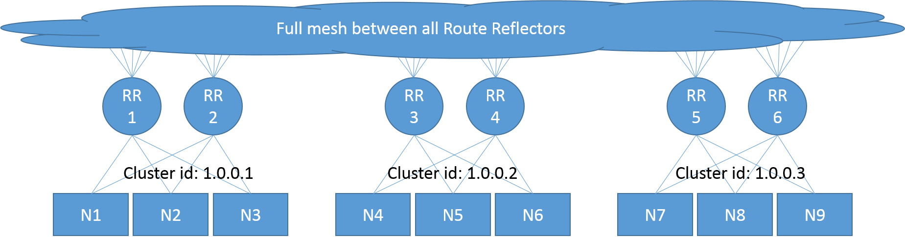

For many Calico deployments, the use of a Route Reflector is not required.
However, for large scale deployments a full mesh of BGP peerings between each
of your Calico nodes may become untenable.  In this case, route reflectors
allow you to remove the full mesh and scale up the size of the cluster.

This guide discusses the calico/routereflector image: a container image that
packages up the `BIRD` BGP daemon along with the `confd` templating engine to
provide a simple route reflector image which may be used for scaled-out Calico
deployments.

The image is currently experimental and has some key limitations discussed below.
However, it may provide a useful framework for future development.

These instructions are focused around container-based deployments that use the
calico/node container image.

For an OpenStack deployment, read [Configuring BIRD as a BGP Route Reflector](bird-rr-config).

> NOTE: The API and behavior of the calico/routereflector is likely to change in
> future releases.

#### Known limitations

-  The calico/routereflector instance will automatically peer with the Calico
   nodes, but it currently has no mechanism to configure peerings with non-Calico
   BGP speakers (e.g. edge routers)
-  There is no `calicoctl` integration or similar.
-  If you are using Kubernetes API as the Calico datastore, the Route Reflector container
   currently only supports running as a single-instance.
-  For etcdv2, the Route Reflector container may be used to form a cluster of route reflectors that
   automatically create a full mesh between each Route Reflector.
   -  Note that there is no `calicoctl` integration and to form a cluster it is necessary to
      configure data directly into the `etcd` datastore for each Route Reflector instance.
   -  It is not possible to form multiple separate meshed groups
      of Route Reflectors using this image.

## Starting and configuring your route reflectors

Follow the appropriate section to start and configure your route reflectors depending on
the datastore you are using for Calico:

-  [Using etcdv2 as the Calico datastore](#using-etcdv2-as-the-calico-datastore)
-  [Using the Kubernetes API as the Calico datastore](#using-the-kubernetes-api-as-the-calico-datastore)

### Using etcdv2 as the Calico datastore

#### Starting a Route Reflector instance

On your Route Reflector host, ensure you have [Docker v1.6](http://www.docker.com) or greater
installed.

Run the following command to start the Route Reflector container image.

```
docker run --privileged --net=host -d                              \
           -e IP=<IPv4_RR>                                         \
           [-e IP6=<IPv6_RR>]                                      \
           -e ETCD_ENDPOINTS=<http://ETCD_IP:PORT>                 \
           calico/routereflector:{{site.data.versions[page.version].first.components["calico/routereflector"].version}}
```

Where:

-  `[]` indicates an optional parameter
-  `<IPv4_RR>` is the IPv4 address of the RR host (the BIRD instance binds to
   the hosts IPv4 address)
-  `<IPv6_RR>` is the *optional* IPv6 address of the RR host (the BIRD6 instance
   binds to the hosts IPv6 address)
-  `<ETCD_IP:PORT>` is the colon separated IPv4 address and port of an etcd
   node in the etcd cluster.  A comma-separated list of endpoints may be
   specified.

> Note: If you require TLS/SSL enabled etcd, see the [section below](#route-reflector-with-tlsssl-etcd)
> for details on how to start the route reflector.

#### Configuring a cluster of Route Reflectors

If you want to use more than one route reflector, the Route Reflector container supports
running as a single cluster of route reflectors.  The Calico BIRD Route Reflector
takes care of creating a full mesh between all of the route reflectors in the
cluster.

To operate a cluster of these route reflectorsm it is necessary to explicitly
add an entry into etcd for each route reflector.  The following steps indicate how
to add an entry into etcd.

The configuration for the Route Reflector is stored for IPv4 at:

	/calico/bgp/v1/rr_v4/<RR IPv4 address>

and IPv6 at:

	/calico/bgp/v1/rr_v6/<RR IPv6 address>

In all cases, the data is a JSON blob in the form:

        {
          "ip": "<IP address of Route Reflector>",
          "cluster_id": "<Cluster ID for this RR (see notes)>"
        }

To add this entry into etcd, you could use the following commands:

```
# IPv4 entries
curl -L http://<ETCD_IP:PORT>/v2/keys/calico/bgp/v1/rr_v4/<IPv4_RR> -XPUT -d value="{\"ip\":\"<IPv4_RR>\",\"cluster_id\":\"<CLUSTER_ID>\"}"

# IPv6 entries
curl -L http://<ETCD_IP:PORT>/v2/keys/calico/bgp/v1/rr_v6/<IPv6_RR> -XPUT -d value="{\"ip\":\"<IPv6_RR>\",\"cluster_id\":\"<CLUSTER_ID>\"}"
```

Replacing <ETCD_IP:PORT>, <IPv4_RR>, <IPv6_RR> and <CLUSTER_ID> as required.  For
example, for a Route Reflector with the values:

-  etcd running at http://192.0.2.10:2379
-  The Route Reflector IP address of 192.0.2.50
-  A Cluster ID of 1.0.0.1

the following command would be used to configure the Route Reflector.

```
curl -L http://192.0.2.10:2379/v2/keys/calico/bgp/v1/rr_v4/192.0.2.50 -XPUT -d value="{\"ip\":\"192.0.2.50\",\"cluster_id\":\"1.0.0.1\"}"
```

See [below](#example-topology--multiple-cluster-ids) for details
about large networks and the use and format of the cluster ID.

Repeat the above instructions for every Route Reflector in the cluster.

#### Route Reflector with TLS/SSL Etcd

If you are running secure etcd, you will need to pass in additional options
and set environment variables for the certificate and key files associated
with your etcd instance.

When starting the Route Reflector container image, you need to mount the
certificate files and environment variable filepaths for each file:

```
docker run --privileged --net=host -d                              \
           -e IP=<IPv4_RR>                                         \
           [-e IP6=<IPv6_RR>]                                      \
           -e ETCD_ENDPOINTS=<https://ETCD_IP:PORT>                \
           -v <FULL_PATH_TO_CERT_DIR>:<MOUNT_DIR>                  \
           -e ETCD_CA_CERT_FILE=<MOUNT_DIR>/<CA_FILE>              \
           -e ETCD_CERT_FILE=<MOUNT_DIR>/<CERT_FILE>               \
           -e ETCD_KEY_FILE=<MOUNT_DIR>/<KEY_FILE>                 \
           calico/routereflector:{{site.data.versions[page.version].first.components["calico/routereflector"].version}}
```

Where `<FULL_PATH_TO_CERT_DIR>` is a directory on the host that contains
the certificate files (you can mount multiple directories with additional
`-v <DIR>` parameters if they are in separate directories, but be sure
to choose different `<MOUNT_DIR>` locations if this is the case).

You will also need to pass the certificate and key files as parameters
in the curl statement when adding entries:

```
# IPv4 entries
curl --cacert <path_to_ca_cert> --cert <path_to_cert> --key <path_to_key> -L https://<ETCD_IP:PORT>:2379/v2/keys/calico/bgp/v1/rr_v4/<IPv4_RR> -XPUT -d value="{\"ip\":\"<IPv4_RR>\",\"cluster_id\":\"<CLUSTER_ID>\"}"
# IPv6 entries
curl --cacert <path_to_ca_cert> --cert <path_to_cert> --key <path_to_key> -L https://<ETCD_IP:PORT>:2379/v2/keys/calico/bgp/v1/rr_v6/<IPv6_RR> -XPUT -d value="{\"ip\":\"<IPv6_RR>\",\"cluster_id\":\"<CLUSTER_ID>\"}"
```

### Using the Kubernetes API as the Calico datastore

If you are using Kuberenetes as the datastore for Calico, the Calico Route
Reflector container only supports running as a single route reflector.  It is not
possible with this image to set up a cluster of route reflectors.

#### Starting up the Route Reflector

On your Route Reflector host, ensure you have [Docker v1.6][docker] or greater
installed.

You will need a kubeconfig file that you need to mount into the route reflector
container.

Run the following command to start the Route Reflector container image.

```
docker run --privileged --net=host -d                              \
           -e DATASTORE_TYPE=kubernetes                            \
           -e KUBECONFIG=/kubeconfig                               \
           -e IP=<IPv4_RR>                                         \
           -v <KUBECONFIG FILE PATH>:/kubeconfig                   \
           calico/routereflector:{{site.data.versions[page.version].first.components["calico/routereflector"].version}}
```

Where:

-  `<IPv4_RR>` is the IPv4 address of the RR host (the BIRD instance binds to
   the hosts IPv4 address)
-  `<KUBECONFIG FILE PATH>` is the path to the kubeconfig file.

When using Kubernetes API as the datastore, this route reflector image only works
as a single standalone reflector.


## Configuring Calico to use the route reflectors

Run through this section  to set up the global Calico configuration
before configuring any nodes.  This only needs to be done once.

-  Disable the full node-to-node BGP mesh
-  Configure the default node AS number for your network (this is used by
   the Route Reflector image when setting up the Route Reflector full mesh).

If you have a small cluster of Route Reflectors and you intend to have every
Calico Docker node peer with every Route Reflector, set this up one time as
global configuration.


### Turn off the full node-to-node mesh

From any Calico Docker node, run the following:

    calicoctl config set nodeToNodeMesh off


### Determine the AS number for your network

From any Calico Docker node, run the following:

    calicoctl get nodes --output=wide

This returns table of all configured Calico node instances and includes the AS
number for each node.

### Peering with every Route Reflector (optional)

If you have a small cluster of Route Reflectors (e.g. a single RR or a pair of
RRs for redundancy) and you intend to have every Calico Docker node peer with
each of the Route Reflectors, you can set up the peerings as a one-time set of
global configuration.

Use `calicoctl` to configure each route reflector as a global peer (i.e. it
peers with every node in the deployment):

```
calicoctl bgp peer add <IP_RR> as <AS_NUM>
$ calicoctl create -f - << EOF
apiVersion: v1
kind: bgpPeer
metadata:
  peerIP: <IP_RR>
  scope: global
spec:
  asNumber: <AS_NUM>
EOF
```

Where:
-  `<IP_RR>` is the IPv4 or IPv6 address of the Route Reflector.
-  `<AS_NUM>` is the AS number to use for the network (set or determined
   above).

## Setting up node-specific peering

If you are deploying a cluster of Route Reflectors, with each Calico node
peering to a subset of Route Reflectors it will be necessary to set up the
peerings on a node-by-node basis.

This would be the typical situation when scaling out to a very large size.  For
example, you may have:

-  a cluster of 100 route reflectors connected in a full mesh
-  a network of 100,000 Calico Docker nodes
-  each Calico Docker node is connected to two or three different Route
   Reflectors.

### Configuring a node-specific Route Reflector peering

To configure a Route Reflector as a peer of a specific node, run the following
*from the node*:

```
$ cat << EOF | calicoctl create -f -
apiVersion: v1
kind: bgpPeer
metadata:
  peerIP: <IP_RR>
  scope: node
  node: <NODENAME>
spec:
  asNumber: <AS_NUM>
EOF
```

Where:
-  `<IP_RR>` is the IPv4 or IPv6 address of the Route Reflector.
-  `<AS_NUM>` is the AS number to use for the network (set or determined
   above).
-  `<NODENAME>` is the name of the node.

Run this separately for each Route Reflector that you want to peer with the
node.

## Additional information

### Example topology / multiple cluster IDs

When the topology includes a cluster of Route Reflectors, BGP uses the concept
of a cluster ID to ensure there are no routing loops when distributing routes.

The Route Reflector image provided assumes that it has a fixed cluster ID for
each Route Reflector rather than being configurable on a per peer basis.

For example, the topology outlined in the diagram below is based on the Top of
Rack model:

-  Each rack is assigned its own cluster ID (a unique number in IPv4 address
   format).
-  Each node (server in the rack) peers with a redundant set of route
   reflectors specific to that rack.
-  All of the ToR route reflectors form a full mesh with each other.

